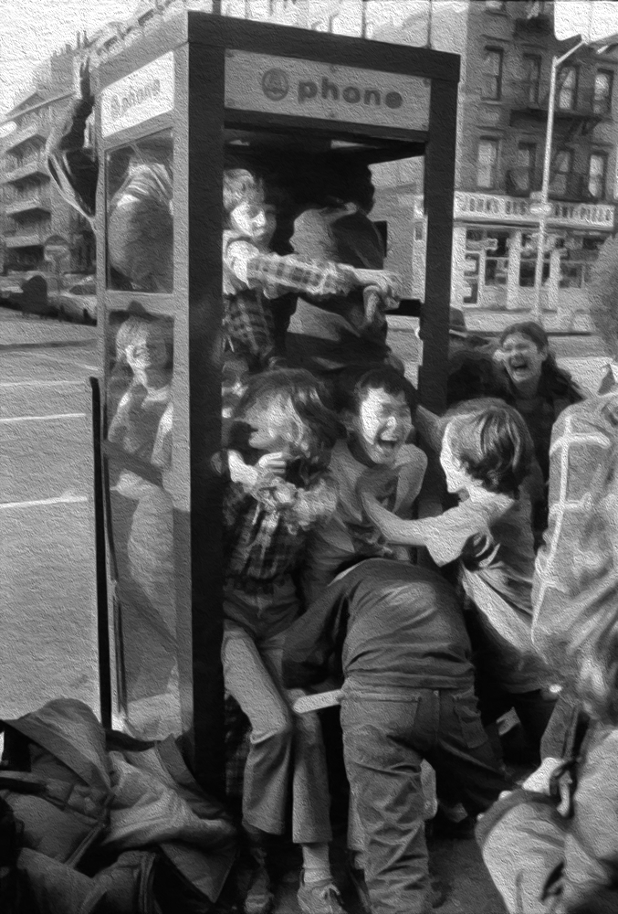

% Carpentry Con 2022  GIT Class Repo Wrangler
% David Palmquist
% August 02, 2022

# Introduction
## Sign In / Collaboration
[CodiMD](https://codimd.carpentries.org/KxKhyablReeYwKveWVRuYA?both)

## A bit about me
- David Palmquist
- email: dpalmquist@fullerton.edu
- github: quist00
- California State University, Fullerton Analyst / Programmer
    - Career Center for 15 years
    - Pollak Library for 6 years
- Carpentries Instructor for about 3 years

## Overview
- Why the tool exists. [Repo](https://github.com/quist00/carpentriesGitClassRepoWrangler)
- Evolution
    - V0 bag of scripts
    - V1 and the phone booth problem
    - V1.1:  a little bit of branching
- See how it works
- Brain Storming Making It Better
- Coding and Committing Guidelines
- Accomplished / Kudos / Blog Post???

## Why the tool exists
Short answer: FEAR! 

---

- Early pandemic
- Transitioned to teaching python over zoom in my own non-official workshops
- Stragegically avoided GIT module due to the complexity

---

- Then, Volunteered to co-teach full Software Carpentry Workshop. 
    - Even though I was only the helper for the GIT section, trying to do that remotely was a concern.  It was challenging enough in person.  I had a few weeks, so I tried to come up with some helper scripts

## Version 0 was born 
- a series of helper scripts in a jupyter/vs code file that I could run in the background as the helper. 
- worked well enough, but was not enough time at the end to discover it's main weakness

## Version 1: convert it to a command line utility
- second test was great until the end
- was able to run it myself from the commandline as I taught the section

---

:::::::::::::: {.columns}
::: {.column }
- only problem was the "phone booth problem," i.e. 25 committers trying to commit on main simultaneously
:::
::: {.column }
{ height=500px }
:::
::::::::::::::

---
Thus,

Version 1.1 was born in an attempt to solve the "phone booth problem." It moved files to individual branches.  This will necessitate teaching a little bit about branching, which is not in the current SWC lesson.  If there is a better way, then let's find it during the brainstorming session later.

# Demo
## Class command/checklist
 - edit roster to include class names
 - invite people to be collaborators ./gcrw invite
 - generate solo files ./gcrw files
 - have them clone the repo and checkout their branch by username
 - generate conflict ./gcrw files --conflict
 - have them edit file, try to commit, then resolve conflict

# Feature Planning 

## Brain Storming: What should it do?
- Pull roster from sources?
- Add better exception handling
    - Continue after item failure
    - Report what succeeded and what failed

## Coding and Committing Guidelines
- Clone repo and use pull request model for contributions.
    - Pull requests require at least one approval
    - Pull request require code owner approval
- Get added to the [project board](https://github.com/users/quist00/projects/1) so we can organize who is working on what.
    - Mistakes may happen on the way.  Have Patience and Kindness for yourself and others.
- Use variables_like_this rather than variablesLikeThis
- If that is new to you, don't let it stop you from contributing. Take this opportunity to learn.

# Wrap Up
## Acknowledgements / Contact
Thank you all for coming, and thanks to the conference organisers, our facilitator and zoom support.

- David Palmquist
- email: dpalmquist@fullerton.edu
- github: quist00

# Follow Up
## Accomplished
## Kudos
## Blog Post???